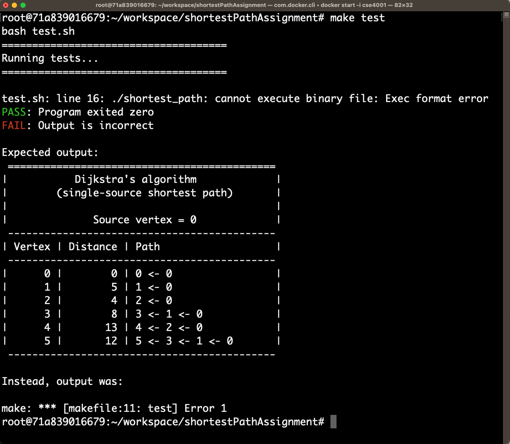
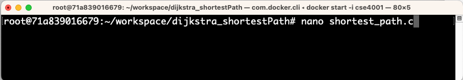
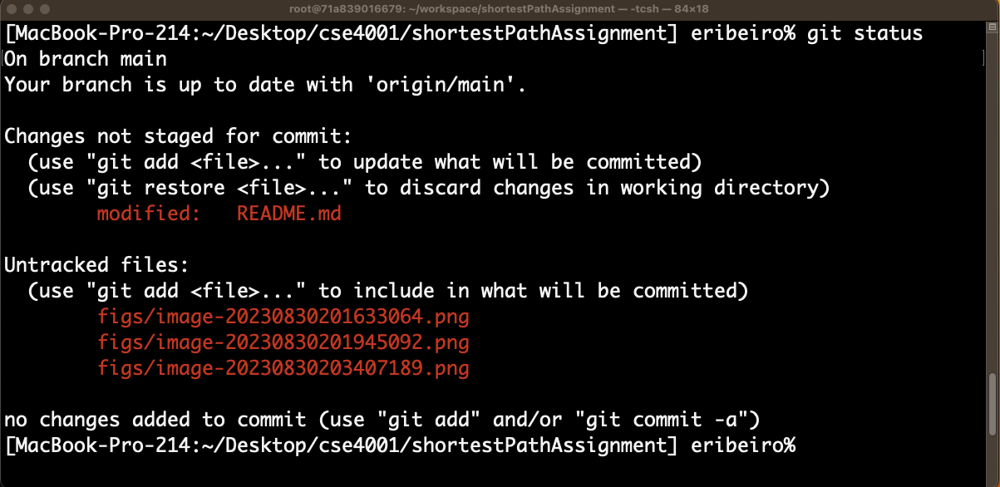

# Displaying the shortest paths of the Dijkstra’s algorithm

## Overview

In this assignment, you will modify the code of the Dijkstra’s single-source shortest-distance algorithm so that, in addition to printing the shortest-path distances, it will also print the shortest paths as a “list” of nodes. The program’s output will follow a specific tabular format.  

**Write your own code. Do not copy a solution from the Web or from anyone else**. You must study the starter code and modify it to obtain the expected output. You must not copy parts of solutions from the Web or any other source. At this point of your degree, you have already taken the courses `CSE1001`, `CSE1002`, and `CSE2010`, as well as other programming courses. Therefore, you should be able to understand the starter code and modify it on your own with little help from colleagues or any other source, except for clarifying C-Language questions such as “how to format printed output in C”, “how to align text/numerical output in C ”, and similar questions that are not related to obtaining the code that formats the output as asked in this assignment.   

## Starter code

The starter code for this assignment prints the distances from the source node to a given node but it does not show the paths. The starter code is the program: 

- [shortest_path.c](https://github.com/eraldoribeiro/shortestPathAssignment/blob/main/shortest_path.c)

The current output of this program is: 

```shell
Vertex Distance from Source
0 	 0
1 	 5
2 	 4
3 	 8
4 	 13
5 	 12
```

## Expected output format of modified program

The following box shows the expected format of the output of your modified program.

```
 ============================================
|           Dijkstra’s algorithm             |
|        (single-source shortest path)       |
|                                            |
|              Source vertex = 0             |
 --------------------------------------------
| Vertex | Distance | Path                   |
 --------------------------------------------
|      0 |        0 | 0 <- 0                 |
|      1 |        5 | 1 <- 0                 |
|      2 |        4 | 2 <- 0                 |
|      3 |        8 | 3 <- 1 <- 0            |
|      4 |       13 | 4 <- 2 <- 0            |
|      5 |       12 | 5 <- 3 <- 1 <- 0       |
 --------------------------------------------
```

## Getting the assignment repository and starter code

**Work (mostly) on your docker Linux and not on your host computer**. The following steps assume that you will be running commands from inside your docker container Linux (and not from your host OS). While you can copy and paste URLs (e.g., repository names) and some other information onto the container Linux terminal, I recommend that you <u>do most programming and editing tasks</u> on the Linux terminal (inside the container). 

**The source code for this assignment is available from GitHub**. To get the code, you will `clone` the assignment’s repository. The cloning step will create a (local) copy of the assignment repository on your computer. Once you have your local copy of the assignment repository, you will edit the program [shortest_path.c](https://github.com/eraldoribeiro/shortestPathAssignment/blob/main/shortest_path.c) so it  produces the expected formatted output. 

**Building and testing the program**. Building and testing the program is easy as the repository comes with a `makefile` and a test script (i.e., `test.sh`). The makefile will help you build and also test the program to see if it pass the basic tests. Note that you do not need to call the test script directly. To test your program, you just need to call `make test` as follows: 



`make test` compiles the program and run the test script for you. This test script tests two basic cases. The first test case is always a pass for this assignment as it tests the return value of the program’s main function. This return value is currently hardcoded into [shortest_path.c](https://github.com/eraldoribeiro/shortestPathAssignment/blob/main/shortest_path.c) so this test will always pass. The second test case tests the output of the program, and this case currently fails because the output is different from the expected formatted output. This is the issue you need to fix to complete this assignment. 

**Editing files to complete the assignment.** While you are free to use any text editor to edit programs, I suggest that you try to edit programs directly on the docker container. A very good reason to edit files directly inside the docker container instead editing in the host computer is that docker sometimes fail to synchronizes changes in files made in the host-computer’s shared folder (https://medium.com/@jonsbun/why-need-to-be-careful-when-mounting-single-files-into-a-docker-container-4f929340834). 

One easy-to-use terminal-based editor is called `nano`. To use `nano`, type `nano <name of the program>` on the command line. See example below: 

 

The following figure shows `nano`’s user interface. 


## Submitting the assignment

To submit the assignment, you will `git commit` and `git push` the repository to the GitHub server. If you add new files, you will also need to `git add` to add the new files to the source control records. As you work on your assignment on the local folder, you can check the status of git by typing `git status`. The following figure shows an example of running `git status` to check the current state of a local repository. 




Once you submit your assignment (i.e., `git push`), you should open the repository URL, refresh it, and check if the changes you made are reflected on the files on the GitHub server. <u>If the changes are not there then you have not submitted the assignment</u>. 

