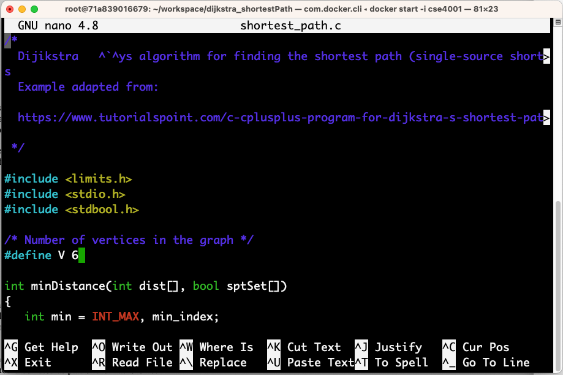

 # Displaying the shortest paths of the Dijkstra’s algorithm

##Overview

In this assignment, you will modify the code of the Dijkstra’s single-source shortest-distance algorithm so that, in addition to printing the distances from the source node to a given node, it will also print the shortest paths. The program’s output will follow a specific tabular format as shown next. 

**Write your own code. Do not copy a solution from the Web or from anyone else**. You must study the starter code and modify it to obtain the expected output. You must not copy parts of solutions from the Web or any other source. At this point of your degree, you have already taken the courses `CSE1001`, `CSE1002`, and `CSE2010`, as well as other programming courses. As a result, you should be able to understand the starter code and modify it on your own with little help from colleagues or any other source, except for clarifying C-Language questions such as “how to format printed output in C”, “how to align text/numerical output in C ”, and similar questions that are not related to obtaining the code that formats the output as asked in this assignment.   

## Starter code

The starter code for this assignment prints the distances from the source node to a given node but it does not show the paths. The print out of the code is given below:

``` c
/*
  Dijikstra’s algorithm for finding the shortest path (single-source shortest path).

  Example adapted from:
  https://www.tutorialspoint.com/c-cplusplus-program-for-dijkstra-s-shortest-path-algorithm
 */

#include <limits.h>
#include <stdio.h>
#include <stdbool.h>

/* Number of vertices in the graph */
#define V 6 

int minDistance(int dist[], bool sptSet[])
{
   int min = INT_MAX, min_index;
   for (int v = 0; v < V; v++)
      if (sptSet[v] == false && dist[v] <= min)
         min = dist[v], min_index = v;

   return min_index;
}

void printSolution(int dist[], int n)
{
   printf("Vertex Distance from Source\n");

   for (int i = 0; i < V; i++)
      printf("%d \t %d\n", i, dist[i]);
}


void dijkstra(int graph[V][V], int src)
{
   int dist[V];
   bool sptSet[V];
   int i;

   for (i = 0; i < V; i++)
      dist[i] = INT_MAX;
      sptSet[i] = false;
      dist[src] = 0;

   for (int count = 0; count < V - 1; count++) {
      int u = minDistance(dist, sptSet);
      sptSet[u] = true;
      for (int v = 0; v < V; v++)
         if (!sptSet[v] && graph[u][v] && dist[u] != INT_MAX && dist[u] + graph[u][v] < dist[v])
            dist[v] = dist[u] + graph[u][v];
   }

   printSolution(dist, V);
}
int main()
{

   int graph[V][V] = {
      { 0,  5,  4,  0,  0, 0 },
      { 5,  0,  6,  3,  0, 0 },
      { 4,  6,  0, 10,  9, 0 },
      { 0,  3, 10,  0,  7, 4 },
      { 0,  0,  9,  7,  0, 8 },
      { 0,  0,  0,  4,  8, 0 }
   };


   dijkstra(graph, 0);

   return 0;
}
```

The current output of this program is: 

```shell
Vertex Distance from Source
0 	 0
1 	 5
2 	 4
3 	 8
4 	 13
5 	 12
```


## Expected output format of modified program

The following box shows the expected format of the output of your modified program.

```
 ============================================
|           Dijkstra’s algorithm             |
|        (single-source shortest path)       |
|                                            |
|              Source vertex = 0             |
 --------------------------------------------
| Vertex | Distance | Path                   |
 --------------------------------------------
|      0 |        0 | 0 <- 0                 |
|      1 |        5 | 1 <- 0                 |
|      2 |        4 | 2 <- 0                 |
|      3 |        8 | 3 <- 1 <- 0            |
|      4 |       13 | 4 <- 2 <- 0            |
|      5 |       12 | 5 <- 3 <- 1 <- 0       |
 --------------------------------------------

```


## Getting the assignment repository and starter code

The source code for this assignment is available from GitHub. To get the code, you will `git clone` the assignment’s repository. This will create a copy of the assignment files on your computer. 

#### Cloning the source code from GitHub


#### How to build and run the executable program

Use your **CSE4001 docker container** to edit, build, and run the program. Use `make` to build the program. See example below: 


You can also edit the program directly on the docker container using the `nano` text editor. To use `nano`, type `nano <name of the program>` on the command line. See example below: 

 

The following figure shows `nano`’s user interface. 



You are free to use any text editor to edit the program. 